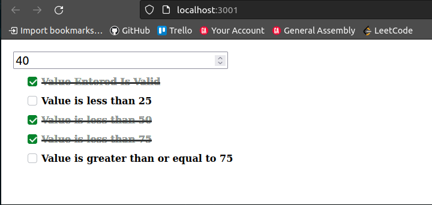

# Checkbox Example

## Overview: What does this program do?
This program is designed to provide the baseline code to insert a checkbox.  The code is arranged in a way to re-utilize the same component as many times as desired.

## How is this accomplished?

### Step 1: Storing the Data
Create a `useState()` that will save the instances each time the component is rerendered.  

This looks something like: 
```
const [ instanceCheckbox , setInstanceCheckbox ] = useState({
    instance01: false,
    instance02: false,
    instance03: false,
    instance04: false,
    instance05: false
})
```

Upon changing the sate of an instance to `true`, the checkbox feature will trigger.

### Step 2: Create the Checkbox Component
The Checkbox component will take in 3 criteria:
1) **instanceKey** - which item you are changing
2) **instanceCheckbox** - object containing all instances
3) **description** - description field after checkbox

or 

```
function Checkbox( { instanceKey, instanceCheckbox, description } ) {
    //SEE COMPONENT FOR FULL CODE
}
```

Style the Checkbox Component (see Checkbox.scss for code)

### Step 3: Link the Input to the Checkbox Component
After creating the checkbox and managing where inputs will be stored, create an input that manipulates the `instanceCheckbox` each time a value is input.

An input can looks similar to this:
```
<input 
    className="all-input"
    type="number" 
    min="0"
    max="100"
    placeholder="Enter a Value Between 0 and 100"
    onChange={(e) => (
        setInstanceCheckbox({
            "instance01": isValid(e.target.value) ? true : false,
            "instance02": isValid(e.target.value) && parseInt(e.target.value) < 25 ? true : false,
            "instance03": isValid(e.target.value) && parseInt(e.target.value) < 50 ? true : false,
            "instance04": isValid(e.target.value) && parseInt(e.target.value) < 75 ? true : false,
            "instance05": isValid(e.target.value) && parseInt(e.target.value) >= 75 ? true : false
        })       
    )}
></input>
```

### Step 4: Include the Checkbox Component

The Checkbox component is going to feed 3 props into the component:
1) **instanceKey** - which item you are changing
2) **instanceCheckbox** - object containing all instances
3) **description** - description field after checkbox

or 

```
<Checkbox instanceKey={"instance01"} instanceCheckbox={instanceCheckbox} description={"ENTER WHATEVER TEXT YOU WANT"}/>
```

# Final Output Sample


